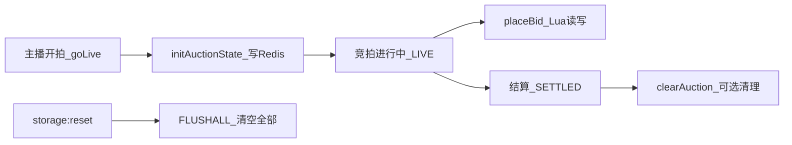
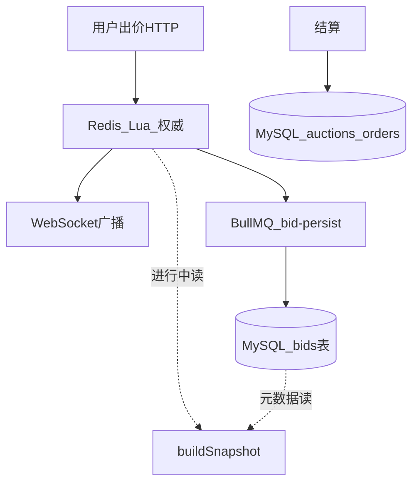

# Redis 在本项目中的用法 — 新人指南

> 面向不熟悉 Redis 的同学。读完本文，你应能：**理解 Redis 在本项目里存什么、怎么操作、和 MySQL 如何分工**。
>
> 配套文档：[新人开发指南.md](./新人开发指南.md) · [README.md](../README.md)

对应代码：[apps/api/src/redis/](../apps/api/src/redis/)

---

## 目录

1. [Redis 是什么？为什么要用？](#1-redis-是什么为什么要用)
2. [部署：全站共用一个 Redis](#2-部署全站共用一个-redis)
3. [五种基本数据结构（本项目用到的）](#3-五种基本数据结构本项目用到的)
4. [Key 命名规则](#4-key-命名规则)
5. [生命周期：何时创建/删除](#5-生命周期何时创建删除)
6. [核心操作详解](#6-核心操作详解)
7. [Redis 和 MySQL 的分工](#7-redis-和-mysql-的分工)
8. [其他 Redis 用途](#8-其他-redis-用途)
9. [本地查看 Redis 数据](#9-本地查看-redis-数据)
10. [命令速查表](#10-命令速查表)
11. [常见问题](#11-常见问题)
12. [代码文件索引](#12-代码文件索引)

---

## 1. Redis 是什么？为什么要用？

可以把 Redis 理解成 **放在内存里的超快键值数据库**（类似一个全局 `Map`），读写通常是 **微秒～毫秒级**，比 MySQL 快很多。

| 对比 | MySQL | Redis |
|------|-------|-------|
| 存哪 | 磁盘为主 | 内存为主 |
| 速度 | 较慢 | 极快 |
| 适合 | 持久化、复杂查询 | 热点数据、计数、排行榜、限流 |
| 本项目角色 | 用户、订单、拍品元数据 | **竞拍进行中的实时状态** |

**本项目为什么用 Redis？**

1000 人同时出价时，如果每次都读写 MySQL，数据库会扛不住。设计是：

- **竞拍进行中**：当前价、领先者、倒计时、排名 → 放 Redis（权威源）
- **竞拍结束后**：出价记录、订单 → 异步写入 MySQL（BullMQ 队列）

---

## 2. 部署：全站共用一个 Redis

不是每个直播间一个 Redis，而是 **整个项目连同一个 Redis 服务**：

```
REDIS_URL=redis://localhost:6379   # .env 里配置
```

Docker 里只有一个 `redis` 容器（`live_auction_redis`）。所有 API 实例、BullMQ 队列、Socket.io 广播适配器，都连这 **同一个** Redis。

不同直播间 / 不同拍品的数据，靠 **Key 名字前缀** 分开，互不干扰。

---

## 3. 五种基本数据结构（本项目用到的）

Redis 里每个 Key 可以存不同类型的数据。本项目主要用 4 种：

### 3.1 String（字符串）

最简单的「一个 key 对应一个值」。

```
Key:   auction:abc123:seq
Value: 42
```

**本项目用途：** 事件序列号 `seq`，每成功出价一次 `INCR` 加 1。

| 命令 | 含义 | 本项目 |
|------|------|--------|
| `SET key value` | 写入 | 开拍时 `SET seq 0` |
| `GET key` | 读取 | 读 seq |
| `INCR key` | 原子 +1 | Lua 脚本里每次出价 `INCR seq` |

---

### 3.2 Hash（哈希 / 字典）

一个 key 下面有多个 **字段:值**，像 JavaScript 对象。

```
Key: auction:abc123:state

字段              值
─────────────────────────
status            LIVE
currentPrice      1500
leaderId          user-uuid-xxx
leaderDisplayName 张三
endAt             1748092800000
version           7
minIncrement      100
...
```

**本项目用途：** 存一场拍品的 **全部热状态**（最核心的一块）。

| 命令 | 含义 | 本项目 |
|------|------|--------|
| `HSET key field value` | 写字段 | 开拍初始化、Lua 更新价格 |
| `HGET key field` | 读单个字段 | Lua 读 status、currentPrice |
| `HGETALL key` | 读全部字段 | `getState()` 构建快照 |
| `HINCRBY key field 1` | 字段原子 +1 | Lua 里 `version` 自增 |

开拍初始化（`redis.service.ts`）：

```typescript
pipeline.hset(k.state, {
  status: 'LIVE',
  currentPrice: startPrice,
  leaderId: '',
  endAt: endAtMs,
  version: 0,
  minIncrement: rules.minIncrement,
  // ...
});
```

---

### 3.3 Sorted Set / ZSet（有序集合）

每个成员有一个 **分数（score）**，Redis 按分数自动排序。

```
Key: auction:abc123:bids

成员(member)              分数(score=出价金额)
────────────────────────────────────────────
userId1:张三               1500
userId2:李四               1200
userId3:王五               1000
```

**本项目用途：** **出价排行榜**。分数越高排名越前。

| 命令 | 含义 | 本项目 |
|------|------|--------|
| `ZADD key score member` | 加入/更新成员 | Lua 里每次出价写入 |
| `ZREVRANGE key 0 19 WITHSCORES` | 按分数降序取前 20 | 生成 leaderboard |
| `ZCARD key` | 成员总数 | Lua 判断是否有出价 |

member 格式是 `userId:displayName`，例如 `abc-uuid:张三`。

---

### 3.4 Set（集合）

无序、不重复的一堆值。

```
Key: auction:abc123:viewers

成员
──────────────
socket-id-1
socket-id-2
socket-id-3
```

**本项目用途：** 统计 **在线观众数**（WebSocket 连接 id）。

| 命令 | 含义 | 本项目 |
|------|------|--------|
| `SADD key member` | 加入 | 用户 join_auction |
| `SREM key member` | 移除 | 用户 leave / 断线 |
| `SCARD key` | 成员数量 | 显示「xxx 人在线」 |

直播间观众数复用了同一套方法，传入 `room:${roomId}` 作为 id，实际 key 是 `auction:room:{roomId}:viewers`。

---

## 4. Key 命名规则

所有 Key 在 `redis.service.ts` 的 `keys()` 方法里定义：

| Key 模式 | 类型 | 存什么 |
|----------|------|--------|
| `auction:{拍品ID}:state` | Hash | 当前价、领先者、倒计时、版本号等 |
| `auction:{拍品ID}:bids` | ZSet | 出价排行榜 |
| `auction:{拍品ID}:seq` | String | 事件序列号 |
| `auction:{拍品ID}:rl:{用户ID}` | String | 该用户出价次数（限流） |
| `auction:{拍品ID}:viewers` | Set | 在线观众 socket id |

**举例：** 拍品 ID 为 `aaa-bbb-ccc`，Redis 里会有：

```
auction:aaa-bbb-ccc:state
auction:aaa-bbb-ccc:bids
auction:aaa-bbb-ccc:seq
auction:aaa-bbb-ccc:rl:user-123
auction:aaa-bbb-ccc:viewers
```

10 个直播间、50 个拍品 → 仍是 **同一个 Redis**，只是 key 更多。

---

## 5. 生命周期：何时创建/删除



| 时机 | 操作 | 代码位置 |
|------|------|----------|
| 开拍 | `initAuctionState()` 创建 state/bids/seq | `auction.service.goLive()` |
| 出价 | Lua 脚本读写 state/bids/seq | `bidding.service.placeBid()` |
| 加入 WS | `addViewer()` | `realtime.gateway.handleJoin()` |
| 结算 | `setStatus('SETTLED')` | `settlement.service.settle()` |
| 重置演示 | `FLUSHALL` 清空整个 Redis | `scripts/reset-storage.mjs` |

**注意：** 出价记录最终会通过 BullMQ **异步写入 MySQL** 的 `bids` 表；Redis 里的 ZSet 是 **实时排名**，MySQL 是 **持久化存档**。

---

## 6. 核心操作详解

### 6.1 开拍：初始化状态

调用链：`goLive()` → `redis.initAuctionState()`

```
1. DEL  删掉旧的 state/bids/seq（防止脏数据）
2. HSET state  写入初始字段（status=LIVE, currentPrice=起拍价, version=0...）
3. SET  seq=0
```

用 **pipeline（管道）** 把多条命令打包一次发送，减少网络往返。

---

### 6.2 出价：Lua 脚本（最重要）

**为什么不用普通 TypeScript 读写 Redis？**

假设两个用户 **同一毫秒** 出价：

```
错误做法（非原子）:
  用户A 读 currentPrice=1000
  用户B 读 currentPrice=1000   ← 同时读到旧值
  用户A 写 currentPrice=1100
  用户B 写 currentPrice=1100   ← B 覆盖了 A，A 的出价丢失！
```

**Lua 脚本** 在 Redis 里 **整段原子执行**，中间不会被打断，类似数据库事务。

脚本文件：`apps/api/src/redis/scripts/place-bid.lua`

**执行流程：**

```
1. HGET status        → 必须是 LIVE
2. HGET endAt         → 不能已过期
3. HGET version       → 和客户端 expectedVersion 比对（乐观锁）
4. 算最低出价         → 无出价: ≥起拍价；有出价: ≥当前价+加价幅度
5. 检查封顶价         → 超过则 clamp 到 cap，标记 settledByCap
6. 软关闭             → 最后 N 秒内出价则延长 endAt
7. HSET 更新价格/领先者/endAt/version
8. INCR seq
9. ZADD 写入排行榜
10. ZREVRANGE 取 top 20
11. 若封顶 → HSET status=SETTLED
12. return JSON 结果
```

TypeScript 调用方式（`redis.service.ts`）：

```typescript
// 启动时 LOAD 脚本，得到 SHA 摘要
await redis.script('LOAD', PLACE_BID_SCRIPT);

// 出价时用 EVALSHA 执行（传 3 个 key + 12 个参数）
await redis.evalsha(sha, 3, stateKey, bidsKey, seqKey, userId, displayName, amount, ...);
```

成功返回 JSON 示例：

```json
{
  "ok": true,
  "currentPrice": 1100,
  "leaderId": "user-uuid",
  "leaderDisplayName": "张三",
  "endAt": 1748092800000,
  "version": 8,
  "seq": 15,
  "leaderboard": [],
  "extended": 0,
  "previousLeaderId": "old-user-uuid"
}
```

失败时 `"ok": false, "code": "BID_TOO_LOW"` 等。

---

### 6.3 限流：防止恶意刷出价

`bidding.service.ts` 在调 Lua **之前**：

```typescript
// 默认：1 秒内同一用户最多 2 次出价（.env 可配）
await redis.checkRateLimit(auctionId, userId, 2, 1000);
```

Redis 操作：

```
INCR auction:{id}:rl:{userId}     → 计数 +1
PEXPIRE key 1000                  → 第一次设置 1 秒过期
若 count > 2 → 拒绝，返回 RATE_LIMITED
```

---

### 6.4 读排行榜

```typescript
await redis.zrevrange('auction:{id}:bids', 0, 19, 'WITHSCORES');
// 返回 [member1, score1, member2, score2, ...] 按分数从高到低
```

---

## 7. Redis 和 MySQL 的分工



| 数据 | 进行中存在哪 | 持久化在哪 |
|------|--------------|------------|
| 当前价、领先者 | Redis Hash | 异步同步到 MySQL `auctions.currentPrice` |
| 排行榜 | Redis ZSet | 异步写入 MySQL `bids` 表 |
| 拍品标题、规则 | MySQL | MySQL |
| 订单 | — | MySQL（结算时创建） |

**buildSnapshot()** 会把 Redis 热状态 + MySQL 元数据 **合并** 成前端需要的 `AuctionSnapshot`。

---

## 8. 其他 Redis 用途

| 用途 | 说明 |
|------|------|
| **Socket.io Redis Adapter** | 多个 API 实例之间广播 WS 消息（`SOCKET_IO_REDIS_ADAPTER=true`） |
| **BullMQ** | 任务队列 `bid-persist`，job 数据也存 Redis |
| **限流 key** | `auction:{id}:rl:{userId}` |

---

## 9. 本地查看 Redis 数据

### 9.1 用 redis-cli

```bash
# 进入 Docker 里的 Redis
docker exec -it live_auction_redis redis-cli

# 查看所有 auction 相关的 key
KEYS auction:*

# 看某场拍品状态
HGETALL auction:你的拍品UUID:state

# 看排行榜
ZREVRANGE auction:你的拍品UUID:bids 0 9 WITHSCORES

# 看在线人数
SCARD auction:你的拍品UUID:viewers

# 看序列号
GET auction:你的拍品UUID:seq
```

> 生产环境慎用 `KEYS *`，数据量大时会阻塞 Redis。本地演示没问题。

### 9.2 用 Redis Commander（可视化）

```bash
docker compose --profile dev-tools up -d redis-commander
# 浏览器打开 http://localhost:8081
```

### 9.3 动手练习建议

1. `npm run storage:reset` 重置
2. 主播开拍一件商品
3. 买家出几次价
4. 在 redis-cli 里 `HGETALL auction:xxx:state`，观察 `currentPrice`、`version` 变化

---

## 10. 命令速查表

| 命令 | 类型 | 作用 |
|------|------|------|
| `HSET / HGET / HGETALL` | Hash | 拍品状态 |
| `ZADD / ZREVRANGE / ZCARD` | ZSet | 排行榜 |
| `SET / GET / INCR` | String | seq、限流计数 |
| `SADD / SREM / SCARD` | Set | 在线观众 |
| `DEL` | 通用 | 清理拍品 key |
| `INCR + PEXPIRE` | String | 限流窗口 |
| `EVALSHA` | 脚本 | 原子出价 |
| `FLUSHALL` | 通用 | storage:reset 清空全部 |

---

## 11. 常见问题

**Q：Redis 挂了会怎样？**  
进行中的竞拍无法出价；MySQL 里仍有拍品元数据，但实时价/排名丢失。恢复后需重新 goLive 或从 MySQL 重建（当前未实现自动重建）。

**Q：Redis 和 MySQL 价格不一致？**  
进行中以 **Redis 为准**；MySQL 的 `currentPrice` 由 BullMQ 异步更新，可能略滞后几秒。

**Q：为什么用 Lua 而不是 Redis 事务（MULTI/EXEC）？**  
Lua 可以在 Redis 里 **写逻辑**（if/else、算最低出价、软关闭），MULTI 只能批量执行预定义命令，做不了复杂判断。

**Q：每个直播间要单独 Redis 吗？**  
不需要。Key 前缀已隔离；单 Redis 7 实例通常够支撑本项目目标并发。

**Q：全站共用一个 Redis，会不会互相影响？**  
不同拍品用不同 key，Lua 脚本对不同 auctionId 可并行执行。同一拍品内出价串行（保证正确性），不同拍品互不影响。

---

## 12. 代码文件索引

| 文件 | 作用 |
|------|------|
| `apps/api/src/redis/redis.module.ts` | 创建 Redis 连接 |
| `apps/api/src/redis/redis.service.ts` | 所有 Redis 操作的 TypeScript 封装 |
| `apps/api/src/redis/scripts/place-bid.lua` | 原子出价脚本 |
| `apps/api/src/auction/bidding.service.ts` | 出价业务流程（调 Redis + 队列 + WS） |
| `apps/api/src/auction/settlement.service.ts` | 结算（读 Redis + 写 MySQL） |
| `apps/api/src/realtime/realtime.gateway.ts` | WS 观众 Set 读写 |

---

*文档版本：2026-05-24 · 与当前代码库同步。*
