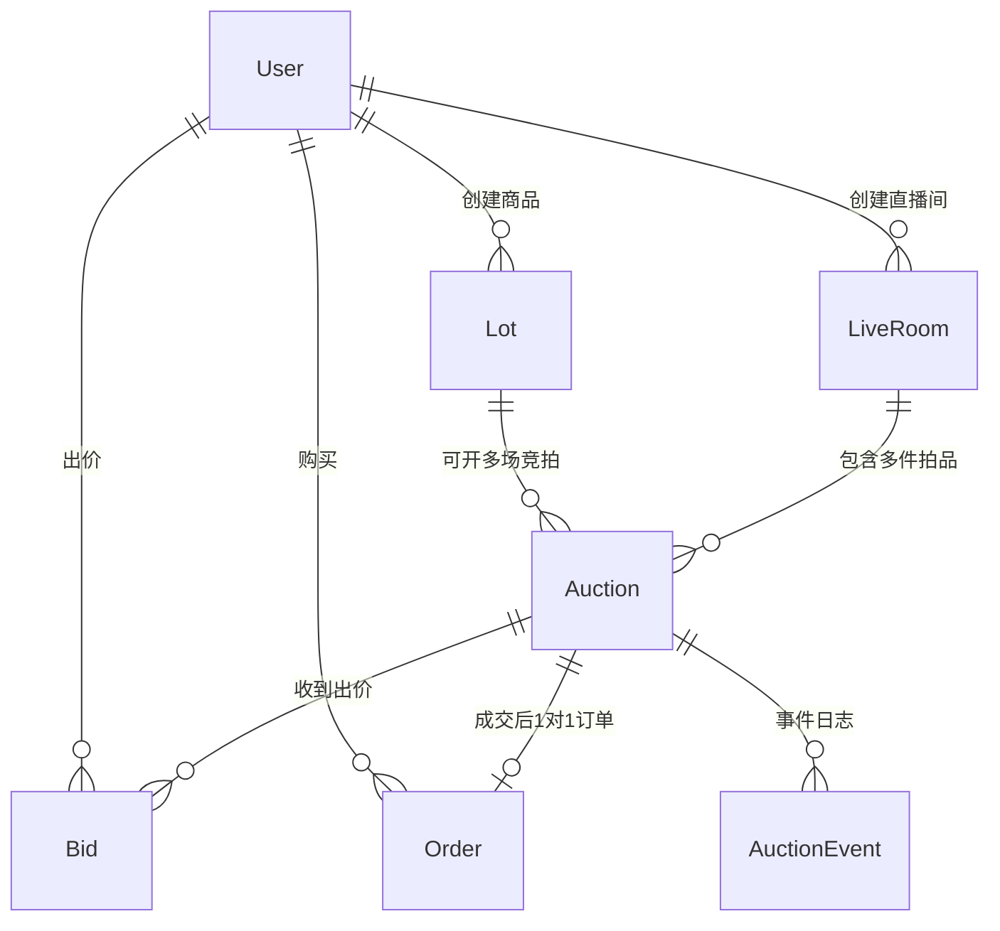
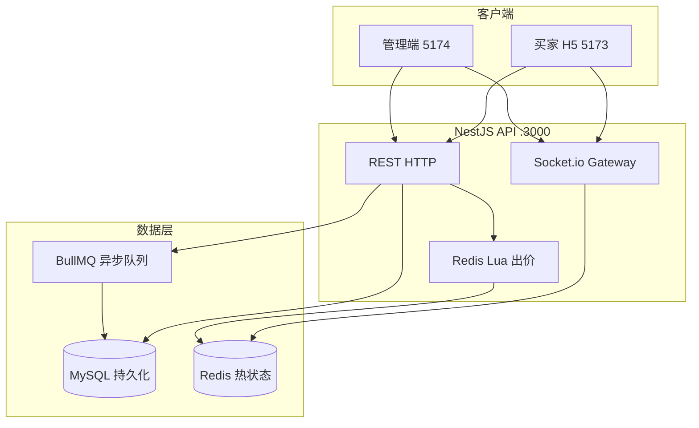
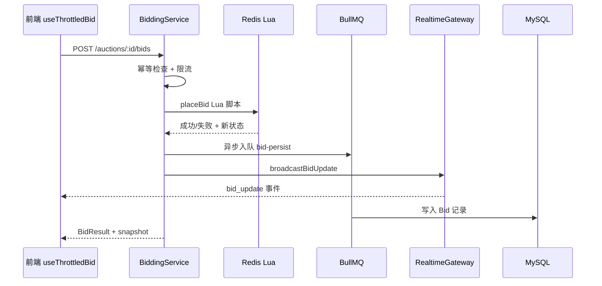
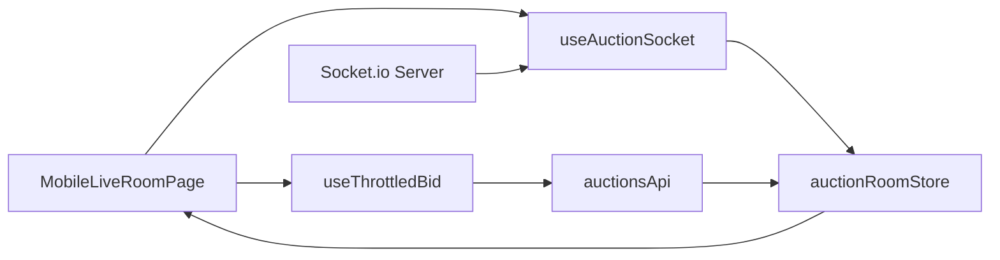

# 直播竞拍系统 — 新人开发指南

> 面向刚入职、开发经验较少的同学。读完本文，你应能：**跑通项目、理解每个模块在做什么、知道改代码该从哪下手**。
>
> 配套文档：[README.md](../README.md)（快速启动）、[项目开发.md](./项目开发.md)（产品方案与 API 清单）、[Redis开发指南.md](./Redis开发指南.md)（Redis 入门与本项目用法）

---

## 目录

1. [项目是做什么的](#1-项目是做什么的)
2. [技术栈速查（零基础友好）](#2-技术栈速查零基础友好)
3. [本地环境搭建](#3-本地环境搭建)
4. [仓库结构总览](#4-仓库结构总览)
5. [核心业务概念](#5-核心业务概念)
6. [数据模型（数据库）](#6-数据模型数据库)
7. [系统架构与数据流](#7-系统架构与数据流)
8. [后端详解（apps/api）](#8-后端详解appsapi)
9. [前端详解（apps/web）](#9-前端详解appsweb)
10. [共享包（packages/shared）](#10-共享包packagesshared)
11. [工具脚本与常用命令](#11-工具脚本与常用命令)
12. [如何拓展开发（实战指南）](#12-如何拓展开发实战指南)
13. [调试与常见问题](#13-调试与常见问题)
14. [术语表](#14-术语表)

---

## 1. 项目是做什么的

这是一个 **直播电商场景下的实时竞拍平台**，模拟抖音/淘宝直播里「主播讲解商品 → 观众出价 → 倒计时落槌 → 生成订单」的完整流程。

### 1.1 两个角色、两个前端

| 角色 | 使用端 | 地址 | 主要操作 |
|------|--------|------|----------|
| **主播/商家** | 管理后台 | http://localhost:5174 | 创建商品、开播、切品讲解、看订单 |
| **买家** | 移动端 H5 | http://localhost:5173/m | 进直播间、出价、看「我参与的」、支付 |

两个前端 **共用同一个后端 API**（http://localhost:3000），但登录态分开存储，互不干扰。

### 1.2 一次完整竞拍的生命周期

```
主播创建商品(Lot) → 配置竞拍规则(Auction) → 加入直播间队列
    → 房间开播(go-live) → 第一件拍品开始竞拍(LIVE)
    → 买家 HTTP 出价 → Redis 原子校验 → WebSocket 广播给所有人
    → 倒计时结束 / 达到封顶价 → 结算(SETTLED) → 生成订单 → 买家模拟支付
    → 主播切到下一件商品 → 循环...
```

---

## 2. 技术栈速查（零基础友好）

如果你不熟悉这些名词，先看这一节：

| 技术 | 是什么 | 在本项目里干什么 |
|------|--------|------------------|
| **TypeScript** | 带类型的 JavaScript | 前后端都用，减少低级错误 |
| **React** | 前端 UI 框架 | 画页面、处理用户交互 |
| **Vite** | 前端构建工具 | 开发时热更新、打包 |
| **NestJS** | 后端框架（类似 Spring） | 组织 API、WebSocket、依赖注入 |
| **Prisma** | 数据库 ORM | 用 TypeScript 操作 MySQL，不用手写 SQL |
| **MySQL** | 关系型数据库 | 持久化用户、商品、订单、出价记录 |
| **Redis** | 内存数据库 | 竞拍热路径：当前价、排名、倒计时（极快） |
| **Lua 脚本** | Redis 里运行的脚本 | 保证「多人同时出价」时数据不会乱 |
| **Socket.io** | WebSocket 库 | 实时推送出价、倒计时给所有观众 |
| **BullMQ** | 任务队列 | 出价成功后异步写入 MySQL（不阻塞热路径） |
| **Zustand** | 前端状态管理 | 存登录态、竞拍快照 |
| **TanStack Query** | 前端数据请求 | 拉列表、缓存、自动刷新 |
| **Zod** | 数据校验库 | 定义「合法输入长什么样」 |

---

## 3. 本地环境搭建

### 3.1 前置条件

- Node.js **≥ 20**
- Docker Desktop（跑 MySQL + Redis）
- 编辑器推荐 VS Code / Cursor

### 3.2 一步步启动

```bash
# 1. 启动数据库
docker compose up -d mysql redis

# 2. 复制环境变量
cp .env.example .env

# 3. 安装依赖
npm install

# 4. 编译共享包（前后端都依赖它）
npm run build -w @live-auction/shared

# 5. 初始化数据库 + 演示数据
npm run storage:reset

# 6. 开三个终端分别启动
npm run dev:api      # 终端1 → API :3000
npm run dev:web      # 终端2 → 买家 H5 :5173
npm run dev:admin    # 终端3 → 管理端 :5174
```

### 3.3 演示账号

| 角色 | 邮箱 | 密码 | 入口 |
|------|------|------|------|
| 主播 | host@example.com | password123 | http://localhost:5174 |
| 买家 | buyer@example.com | password123 | http://localhost:5173/m |
| 买家2 | buyer2@example.com | password123 | http://localhost:5173/m |

演示直播间（种子数据预置）：http://localhost:5173/m/room/00000000-0000-4000-8000-00000000ROOM

### 3.4 Swagger（API 文档）

浏览器打开 http://localhost:3000/docs 可查看所有 REST 接口，支持在线试调。

---

## 4. 仓库结构总览

```
live_auction/
├── apps/
│   ├── api/                 # 后端 NestJS
│   │   ├── src/             # 业务代码（你要改的主要在这里）
│   │   └── prisma/          # 数据库模型 + 迁移 + 种子
│   └── web/                 # 前端 React（买家 + 管理端）
│       └── src/
├── packages/
│   └── shared/              # 前后端共享的类型、常量、校验
├── scripts/                 # 重置数据库、释放端口等工具
├── docker/                  # 容器配置
├── docs/                    # 文档（含本文）
└── load-tests/              # 压测脚本
```

这是一个 **npm monorepo（单仓库多包）**：根目录 `package.json` 通过 workspaces 管理三个子包。

---

## 5. 核心业务概念

理解这些名词，后面读代码才不会晕：

| 概念 | 英文 | 说明 |
|------|------|------|
| **商品** | Lot | 物理商品信息：标题、图片、描述。一个 Lot 可以开多场 Auction |
| **拍品/场次** | Auction | 一次竞拍：有起拍价、加价幅度、时长、封顶价、软关闭规则 |
| **直播间** | LiveRoom | 一场直播，里面排队多件 Auction，同一时刻只有一件「讲解中」 |
| **橱窗** | Showcase | 直播间里所有拍品的展示列表（待开拍 / 竞拍中 / 已成交） |
| **快照** | Snapshot | 某时刻竞拍的完整状态：当前价、领先者、倒计时、排名 |
| **软关闭** | Soft Close | 最后 N 秒内有人出价则自动延时（防狙击） |
| **版本号** | version | 乐观锁：出价时带上，防止基于过期数据出价 |
| **序列号** | seq | 事件单调递增序号，客户端丢弃乱序的旧消息 |

### 5.1 竞拍状态机

```
DRAFT → SCHEDULED → LIVE → CLOSING → SETTLED
                  ↘ CANCELLED（主播取消）
                  ↘ FAILED（流拍，如未达保留价）
```

### 5.2 直播间状态

```
PREPARE（筹备） → LIVE（直播中） → ENDED（已结束）
```

---

## 6. 数据模型（数据库）

模型定义在 `apps/api/prisma/schema.prisma`。用 Prisma 读写的，表名在 `@@map` 里。

### 6.1 实体关系图



### 6.2 各表说明

#### User（用户）

| 字段 | 含义 |
|------|------|
| email | 登录邮箱，唯一 |
| passwordHash | bcrypt 加密后的密码 |
| displayName | 显示名（出价排名里展示） |
| role | BUYER / HOST / ADMIN |

#### Lot（商品）

| 字段 | 含义 |
|------|------|
| hostId | 所属主播 |
| title, description, imageUrl | 商品信息 |
| status | DRAFT → ACTIVE（发布后可挂竞拍） |

#### LiveRoom（直播间）

| 字段 | 含义 |
|------|------|
| hostId | 主播 |
| status | PREPARE / LIVE / ENDED |
| activeAuctionId | 当前讲解中的拍品 ID（非外键，逻辑关联） |

#### Auction（拍品/场次）

| 字段 | 含义 |
|------|------|
| lotId | 关联商品 |
| roomId, sortOrder | 所属直播间及排序 |
| ruleSnapshot | JSON，完整规则（起拍价、加价、软关闭等） |
| status | 状态机 |
| currentPrice | MySQL 侧当前价（Redis 是权威，异步同步） |
| winnerId, settleReason | 落槌后写入 |

#### Bid（出价记录）

| 字段 | 含义 |
|------|------|
| amount | 出价金额 |
| idempotencyKey | 幂等键，防重复提交 |

#### Order（订单）

| 字段 | 含义 |
|------|------|
| auctionId | 一对一关联拍品 |
| status | PENDING_PAYMENT / PAID / CANCELLED |

#### AuctionEvent（事件日志）

记录 STARTED、BID_ACCEPTED、SETTLED 等，便于审计和调试。

---

## 7. 系统架构与数据流

### 7.1 整体架构



### 7.2 出价热路径（最重要）

买家点击「出价」后的完整链路：



**设计要点：**

- **Redis Lua** 保证并发安全（1000 人同时点也不会乱价）
- **HTTP 出价** 返回结果给点击者；**WebSocket** 推送给所有观众
- **BullMQ** 异步落库，出价接口不被 MySQL 拖慢
- **seq 序号** 保证客户端只应用「更新的」消息

### 7.3 倒计时同步

服务端每秒发 `timer_sync`，客户端用 `clockOffset = serverNow - Date.now()` 校正本地时钟，实现毫秒级倒计时显示。

---

## 8. 后端详解（apps/api）

后端采用 **NestJS 模块化** 结构：每个业务域一个 Module，内含 Controller（路由）、Service（逻辑）、DTO（入参校验）。

### 8.1 目录树

```
apps/api/src/
├── main.ts                    # 启动入口
├── app.module.ts              # 根模块，注册所有子模块
├── auth/                      # 登录注册
├── catalog/                   # 商品 Lot CRUD
├── auction/                   # 拍品 + 出价 + 结算
├── live-room/                 # 直播间 + 橱窗
├── order/                     # 订单 + 我参与的
├── realtime/                  # WebSocket 网关
├── redis/                     # Redis 封装 + Lua 脚本
└── prisma/                    # 数据库连接
```

---

### 8.2 main.ts — 启动入口

| 做什么 | 说明 |
|--------|------|
| 创建 Nest 应用 | 加载 `AppModule` |
| 注册 Swagger | `/docs` 文档 |
| 加载 Redis Lua 脚本 | 启动时 `SCRIPT LOAD` |
| 启动过期检查定时器 | 每秒扫描 LIVE 拍品是否该结算 |

---

### 8.3 auth 模块 — 认证

**文件：** `auth.service.ts`, `auth.controller.ts`, `jwt.strategy.ts`, `guards/*`

| 函数/类 | 作用 |
|---------|------|
| `AuthService.register()` | 注册：bcrypt 哈希密码 → 写 User 表 → 签发 JWT |
| `AuthService.login()` | 登录：校验密码 → 签发 JWT |
| `AuthController` | `POST /auth/register`, `POST /auth/login` |
| `JwtStrategy` | 解析 Bearer Token → 得到 `{ userId, email, role }` |
| `JwtAuthGuard` | 路由守卫：必须登录 |
| `OptionalJwtAuthGuard` | 可选登录（如 GET 拍品详情，登录与否返回不同内容） |
| `RolesGuard` + `@Roles('HOST')` | 角色校验 |
| `@CurrentUser()` | 装饰器：在 handler 里注入当前用户 |

**JWT payload：** `{ sub: userId, email, role }`

---

### 8.4 catalog 模块 — 商品管理

**文件：** `catalog.service.ts`, `catalog.controller.ts`

| 函数 | 作用 |
|------|------|
| `create(hostId, dto)` | 创建 DRAFT 状态 Lot |
| `update(hostId, lotId, dto)` | 修改 Lot（仅 DRAFT/ACTIVE） |
| `publish(hostId, lotId)` | 发布：DRAFT → ACTIVE |
| `list(hostId?, mine?)` | 列表；`mine=true` 只看自己的 |
| `findOwned(hostId, lotId)` | 查单个 + 所有权校验 |

**路由：**

- `POST /lots` — 创建（HOST/ADMIN）
- `GET /lots?mine=true` — 我的商品
- `PATCH /lots/:id` — 修改
- `POST /lots/:id/publish` — 发布

---

### 8.5 auction 模块 — 拍品核心

这是后端 **最复杂** 的模块，分 4 个 Service + 2 个 Processor。

#### AuctionService — 拍品生命周期

**文件：** `auction.service.ts`, `auction.controller.ts`

| 函数 | 作用 |
|------|------|
| `create(hostId, dto)` | 从 Lot 创建 DRAFT Auction，写入 ruleSnapshot |
| `update(hostId, id, dto)` | 修改 DRAFT/SCHEDULED 的规则 |
| `list(status?)` | 公开列表 |
| `get(id, user?)` | 详情；非 owner 看不到 reservePrice |
| `dashboard(hostId)` | 主播仪表盘：拍品 + 出价人数 |
| `goLive(hostId, id)` | **开拍**：DB → LIVE，初始化 Redis，广播 WS，启动倒计时 |
| `cancel(hostId, id, reason)` | 取消 LIVE 拍品 |

**路由：**

- `GET /auctions`, `GET /auctions/:id`, `GET /auctions/:id/snapshot`
- `POST /auctions` — 创建
- `PATCH /auctions/:id` — 修改规则
- `POST /auctions/:id/go-live` — 开拍
- `POST /auctions/:id/cancel` — 取消

#### BiddingService — 出价热路径

**文件：** `bidding.service.ts`, `bidding.controller.ts`

| 函数 | 作用 |
|------|------|
| `placeBid(userId, displayName, auctionId, dto, idempotencyKey?)` | **核心**：幂等 → 限流 → Lua → 入队 → WS 广播 → 封顶则结算 |
| `handleBidFailure()` | 私有：Lua 失败码 → HTTP 异常 |
| `getSnapshot(auctionId)` | 委托 SettlementService 构建快照 |

**placeBid 流程详解：**

1. 查 DB 确认 status === LIVE
2. 若有 idempotencyKey，查是否已有 Bid，有则直接返回 snapshot
3. `redis.checkRateLimit()` — 默认 1 秒 2 次
4. `redis.placeBid()` — 调用 Lua 脚本
5. 失败 → 返回 errorCode（BID_TOO_LOW 等）
6. 成功 → BullMQ 入队 `bid-persist`
7. `realtime.broadcastBidUpdate()` — 推给所有订阅者
8. 若被超越 → `broadcastOutbid()` 定向推给前领先者
9. 若软关闭延时 → `broadcastTimerExtended()`
10. 若封顶价成交 → 同步调用 `settlement.settle()`

**路由：** `POST /auctions/:id/bids`（需 JWT）

#### SettlementService — 结算

**文件：** `settlement.service.ts`

| 函数 | 作用 |
|------|------|
| `buildSnapshot(auctionId)` | 合并 Redis 热状态 + MySQL 元数据 → `AuctionSnapshot` |
| `settle(auctionId, reason)` | 落槌：检查保留价 → 写 DB → 创建订单 → WS `auction_ended` → 刷新橱窗 |
| `checkExpiredAuctions()` | 每秒轮询：Redis/MySQL 中 LIVE 且 endAt 已过 → settle |
| `scheduleExpiryCheck()` | 在 main.ts 里启动 setInterval(1000) |

#### Processors — 异步任务

| 文件 | 队列名 | 作用 |
|------|--------|------|
| `bid-persist.processor.ts` | `bid-persist` | 把出价写入 MySQL Bid 表，更新 currentPrice，记 AuctionEvent |
| `auction-settle.processor.ts` | `auction-settle` | **占位**，结算目前是同步的 |

---

### 8.6 live-room 模块 — 直播间

**文件：** `live-room.service.ts`, `live-room.controller.ts`, `showcase.mapper.ts`

| 函数 | 作用 |
|------|------|
| `list()` | 全部直播间（H5 大厅用） |
| `listByHost(hostId)` | 主播自己的房间 |
| `create(hostId, dto)` | 新建 PREPARE 房间 |
| `getById(id)` | 房间详情 + 拍品摘要 |
| `getShowcase(roomId)` | **橱窗 DTO**：每件拍品的展示状态、按钮、倒计时 |
| `addAuction(roomId, auctionId)` | 把 SCHEDULED 拍品加入队列 |
| `goLive(roomId)` | 房间开播 → 自动 goLive 第一件 |
| `switchActiveAuction(roomId, auctionId)` | **切品**：结算当前 → 开下一件 |
| `detachAuction(roomId, auctionId)` | 从队列移除未开拍拍品 |
| `broadcastShowcaseIfNeeded(roomId)` | 推送 `showcase_updated` |
| `mapToShowcaseItem()` | 在 showcase.mapper.ts：Auction + Redis → ShowcaseItem |

**路由：**

- `GET /live-rooms` — 大厅列表
- `GET /live-rooms/mine` — 我的房间
- `GET /live-rooms/:id/showcase` — 橱窗
- `POST /live-rooms/:id/go-live` — 开播
- `POST /live-rooms/:id/switch/:auctionId` — 切品
- `DELETE /live-rooms/:id/auctions/:auctionId` — 下架

---

### 8.7 order 模块 — 订单

**文件：** `order.service.ts`, `order.controller.ts`, `me.controller.ts`

| 函数 | 作用 |
|------|------|
| `createFromAuction(auction)` | 结算时创建 PENDING_PAYMENT 订单（幂等） |
| `listForHost(hostId)` | 主播看成交订单 |
| `listForBuyer(buyerId)` | 买家看自己的订单 |
| `listParticipations(buyerId)` | **我参与的**：按拍品聚合，算 isLeading |
| `get(id, user)` | 订单详情 + 权限 |
| `payMock(buyerId, orderId)` | 模拟支付 → PAID |

**路由：**

- `GET /orders` — 主播订单列表
- `GET /me/orders` — 买家订单
- `GET /me/participations` — 我参与的
- `GET /me/bids` — 出价流水（调试用）
- `POST /orders/:id/pay-mock` — 模拟支付

---

### 8.8 realtime 模块 — WebSocket

**文件：** `realtime.gateway.ts`

Socket.io 网关，房间名规则：

- `auction:{auctionId}` — 订阅某场竞拍
- `live-room:{roomId}` — 订阅某直播间橱窗

#### 客户端 → 服务端

| 事件 | 处理函数 | 作用 |
|------|----------|------|
| `join_auction` | `handleJoin` | 加入房间，发 snapshot + timer_sync |
| `leave_auction` | `handleLeave` | 离开 |
| `join_live_room` | `handleJoinLiveRoom` | 加入直播间 |
| `leave_live_room` | `handleLeaveLiveRoom` | 离开 |

#### 服务端 → 客户端

| 事件 | 何时发送 |
|------|----------|
| `snapshot` | 加入竞拍房间时 |
| `auction_started` | goLive 时 |
| `bid_update` | 出价成功 |
| `timer_sync` | 每秒 + 加入/出价后 |
| `timer_extended` | 软关闭延时 |
| `outbid` | 你被超越了（定向） |
| `auction_ended` | 落槌 |
| `auction_cancelled` | 取消 |
| `showcase_updated` | 橱窗变化 |

| 方法 | 作用 |
|------|------|
| `startTimerSync(auctionId)` | 开 1 秒 interval 推 timer_sync |
| `stopTimerSync(auctionId)` | 竞拍结束停掉 |
| `broadcastBidUpdate(...)` | 组装 BidUpdatePayload 广播 |
| `broadcastShowcase(roomId, data)` | 推橱窗 |

---

### 8.9 redis 模块 — 热路径状态

> 零基础可先读专题文档：[Redis开发指南.md](./Redis开发指南.md)

**文件：** `redis.service.ts`, `scripts/place-bid.lua`

#### Redis Key 设计

| Key 模式 | 类型 | 存什么 |
|----------|------|--------|
| `auction:{id}:state` | Hash | status, currentPrice, leaderId, endAt, version, ... |
| `auction:{id}:bids` | ZSet | 排行榜 member=`userId:displayName` score=amount |
| `auction:{id}:seq` | String | 事件序列号 |
| `auction:{id}:rl:{userId}` | String | 限流计数 |
| `auction:{id}:viewers` | Set | 在线观众 socket id |
| `room:{roomId}:viewers` | Set | 直播间观众数 |

#### RedisService 方法

| 方法 | 作用 |
|------|------|
| `loadScripts()` | 启动时加载 Lua |
| `initAuctionState(auctionId, rules)` | goLive 时初始化 Redis |
| `getState(auctionId)` | 读 Hash |
| `placeBid(params)` | 调 Lua，返回 LuaBidResult |
| `checkRateLimit(auctionId, userId, limit, windowMs)` | INCR + 过期 |
| `getLeaderboard(auctionId, topN)` | ZREVRANGE |
| `setStatus(auctionId, status)` | 改状态字段 |
| `clearAuction(auctionId)` | 删除 keys |
| `addViewer / removeViewer / getParticipantCount` | 观众统计 |

#### place-bid.lua 逻辑摘要

1. 检查 status === LIVE、未过期
2. 检查 expectedVersion（乐观锁）
3. 计算最低出价：无出价时 ≥ startPrice，有出价时 ≥ currentPrice + minIncrement
4. 若有 capPrice，clamp 到封顶
5. 更新 leader、currentPrice、version、seq
6. 软关闭：在 triggerWindow 内出价 → endAt += extensionSeconds（不超过 maxTotalExtension）
7. 写 ZSet 排行榜，返回 top 20
8. 若封顶成交 → status = SETTLED

**失败码：** `AUCTION_NOT_LIVE`, `AUCTION_ENDED`, `VERSION_CONFLICT`, `BID_TOO_LOW`

---

### 8.10 prisma 模块

| 类 | 作用 |
|----|------|
| `PrismaService` | 继承 PrismaClient，`onModuleInit` 连库，`onModuleDestroy` 断开 |

全局 Module，任何 Service 可 `@Inject()` 使用。

---

## 9. 前端详解（apps/web）

同一套代码 **构建两次**，产出两个独立 SPA：

| 应用 | 入口 | 命令 | 端口 |
|------|------|------|------|
| 买家 H5 | `main.tsx` → `UserApp.tsx` | `dev:web` | 5173 |
| 管理端 | `main-admin.tsx` → `AdminApp.tsx` | `dev:admin` | 5174 |

---

### 9.1 目录树

```
apps/web/src/
├── UserApp.tsx              # 买家路由
├── AdminApp.tsx             # 管理端路由
├── lib/
│   ├── api.ts               # 所有 REST 请求
│   └── appConfig.ts         # 环境、Token Key
├── stores/
│   ├── authStore.ts         # 登录态
│   └── auctionRoomStore.ts  # 竞拍快照（WS 驱动）
├── hooks/
│   ├── useAuctionSocket.ts  # 竞拍 WebSocket
│   ├── useLiveRoomSocket.ts # 直播间 WebSocket
│   ├── useThrottledBid.ts   # 出价（节流）
│   ├── useCountdown.ts      # 倒计时显示
│   ├── useAuthHydrated.ts   # 等 persist 恢复
│   └── useAdminApiReady.ts  # 管理端 API 就绪
├── layouts/
│   ├── MobileLayout.tsx     # H5 底栏 Tab
│   └── AdminLayout.tsx      # 管理端侧栏
├── components/              # 可复用 UI
└── pages/                   # 页面
    ├── mobile/              # H5 页面
    └── admin/               # 管理端页面
```

---

### 9.2 路由

#### 买家 UserApp

| 路径 | 页面 | 需登录 |
|------|------|--------|
| `/login` | UserLoginPage | 否 |
| `/m` | MobileHomePage（大厅） | 否 |
| `/m/room/:roomId` | MobileRoomPage（直播间+橱窗） | 否 |
| `/m/live/:auctionId` | MobileLiveRoomPage（出价页） | 出价需登录 |
| `/m/auctions/:auctionId` | MobileAuctionDetailPage | 否 |
| `/m/participations` | MobileParticipationsPage | 买家 |
| `/m/orders` | MobileOrdersPage | 买家 |

#### 管理端 AdminApp

| 路径 | 页面 |
|------|------|
| `/login` | AdminLoginPage |
| `/` | AdminLiveConsolePage（直播控制台） |
| `/orders` | AdminOrdersPage |

---

### 9.3 lib/api.ts — HTTP 客户端

核心函数 `api(path, options)`：

- 自动加 `Authorization: Bearer {token}`
- 支持 `Idempotency-Key` 头
- 401 → 自动 logout + 派发 `auth:expired` 事件

**命名空间：**

| 对象 | 主要方法 |
|------|----------|
| `authApi` | login, register |
| `lotsApi` | list, create, update, publish |
| `auctionsApi` | list, get, snapshot, create, update, goLive, cancel, **placeBid** |
| `liveRoomsApi` | list, mine, get, showcase, create, goLive, addAuction, switch, detach |
| `ordersApi` | list, get |
| `meApi` | orders, bids, participations, payMock |

类型全部从 `@live-auction/shared` 导入，保持前后端一致。

---

### 9.4 stores — 状态管理

#### authStore（`authStore.ts`）

| 字段/方法 | 作用 |
|-----------|------|
| `token`, `user` | JWT 和用户信息 |
| `setAuth(token, user)` | 登录成功后写入 |
| `logout()` | 清空 |
| persist | 存 localStorage，key 按 user/admin 分开 |

#### auctionRoomStore（`auctionRoomStore.ts`）

竞拍页的 **单一数据源**，WebSocket 和 HTTP 出价都往这里写。

| 字段/方法 | 作用 |
|-----------|------|
| `snapshot` | 当前 AuctionSnapshot |
| `lastSeq` | 已处理的最新 seq |
| `clockOffset` | 服务端时钟 − 本地时钟 |
| `connectionStatus` | WS 连接状态 |
| `bidPending` | 是否正在提交出价 |
| `setSnapshot(s)` | 全量替换，更新 clockOffset |
| `applyBidUpdate(payload)` | **seq 更大才应用**，增量更新价格/排名 |
| `applyTimerSync(payload)` | 更新 endAt、participantCount |
| `getRemainingMs(state)` | 导出函数：算剩余毫秒（给倒计时用） |

---

### 9.5 hooks — 核心业务逻辑

#### useAuctionSocket(auctionId, userId?)

**文件：** `hooks/useAuctionSocket.ts`

| 做什么 | 说明 |
|--------|------|
| 挂载时 HTTP 拉 snapshot | 兜底，WS 未连上也有数据 |
| 连接 Socket.io | `VITE_WS_URL` 默认 localhost:3000 |
| emit `join_auction` | 订阅房间 |
| listen 各 WS 事件 | 写入 auctionRoomStore |
| outbid / ended / extended | Toast 通知用户 |
| 卸载 emit `leave_auction` | 清理 |

**使用页面：** `MobileLiveRoomPage`

#### useThrottledBid(auctionId)

**文件：** `hooks/useThrottledBid.ts`

| 导出 | 作用 |
|------|------|
| `computeNextBidAmount(snapshot)` | 算下一口价：无出价=startPrice，有出价=current+increment |
| `placeBid(amount)` | 400ms 节流 + bidPending 锁 + 调 API |
| `bidNextIncrement()` | 一键出下一口价 |
| `bidPending` | 按钮 loading 状态 |

出价时传 `snapshot.version`（乐观锁）和 `uuid`（幂等键）。

#### useLiveRoomSocket(roomId, onShowcase)

只监听 `showcase_updated`，回调更新 React Query 缓存或本地 state。

**使用页面：** `MobileRoomPage`

#### useCountdown()

用 `requestAnimationFrame` 循环读 `getRemainingMs()`，格式化为 `MM:SS.mmm`。

#### useAuthHydrated() / useAdminApiReady()

Zustand persist 从 localStorage 恢复是异步的。在恢复完成前不要 redirect 到登录页，也不要发需鉴权的 API。

---

### 9.6 页面说明

#### 买家端

| 页面 | 文件 | 核心逻辑 |
|------|------|----------|
| 大厅 | MobileHomePage | `liveRoomsApi.list()`，按 LIVE→PREPARE→ENDED 排序 |
| 直播间 | MobileRoomPage | 视频层 + 橱窗抽屉；`useLiveRoomSocket` + 3 秒轮询 showcase |
| 出价页 | MobileLiveRoomPage | `useAuctionSocket` + `useThrottledBid` + `useCountdown`；核心 UI |
| 拍品详情 | MobileAuctionDetailPage | 只读规则；LIVE 时跳转出价页 |
| 我参与的 | MobileParticipationsPage | `meApi.participations()`，显示领先/被超越 |
| 订单 | MobileOrdersPage | `meApi.orders()` + payMock |

#### 管理端

| 页面 | 文件 | 核心逻辑 |
|------|------|----------|
| 直播控制台 | AdminLiveConsolePage | 选房间、Tab 待上架/直播中、AddLiveProductModal、切品/下架 |
| 订单 | AdminOrdersPage | `ordersApi.list()` 表格 |

#### 关键组件

| 组件 | 作用 |
|------|------|
| AddLiveProductModal | 一步完成：创建 Lot → 发布 → 创建 Auction → 加入房间 |
| LiveProductCard | 管理端单件拍品卡片（讲解、编辑、下架、倒计时） |
| ShowcasePanel / ShowcaseItemCard | 买家端橱窗列表 |
| LiveVideoLayer | 循环播放 demo 视频 |
| RequireAuth / RequireBuyer / RequireStaff | 路由守卫 |

---

### 9.7 前端数据流（竞拍页）



**原则：** 竞拍状态只存 `auctionRoomStore`，页面组件只读 store，不要自己再维护一份 snapshot。

---

## 10. 共享包（packages/shared）

前后端 **共用一份契约**，改类型两边一起生效。

### 10.1 目录

```
packages/shared/src/
├── schemas/
│   ├── auction-rules.ts    # Zod：规则、创建拍品、出价入参
│   └── auth.ts             # Zod：注册、登录
├── constants/
│   ├── events.ts           # WS_EVENTS, BID_QUEUE 等
│   └── errors.ts           # BID_ERROR_CODES
├── types/
│   ├── auction.ts          # AuctionSnapshot, BidResult, AuctionStatus
│   ├── ws-events.ts        # TimerSyncPayload, BidUpdatePayload, ...
│   ├── showcase.ts         # ShowcaseItem, LiveRoomShowcase
│   └── participation.ts    # MyParticipation
└── utils/
    └── auction-rules.ts    # stripReservePrice()
```

### 10.2 重要类型

#### AuctionSnapshot（竞拍快照）

前端 UI 和后端 WS 都围绕这个结构：

```typescript
{
  auctionId, title, status,
  startPrice, minIncrement, currentPrice,
  leaderId, leaderDisplayName,
  endAt, serverNow,        // 毫秒时间戳
  version, seq,             // 乐观锁 + 事件序
  capPrice?, participantCount?,
  leaderboard: LeaderboardEntry[],
  settleReason?
}
```

#### WS_EVENTS（WebSocket 事件名）

```typescript
JOIN_AUCTION: 'join_auction'
BID_UPDATE: 'bid_update'
TIMER_SYNC: 'timer_sync'
// ... 见 packages/shared/src/constants/events.ts
```

#### BID_ERROR_CODES

`AUCTION_NOT_LIVE`, `BID_TOO_LOW`, `VERSION_CONFLICT`, `RATE_LIMITED`, ...

### 10.3 修改共享包的流程

```bash
# 1. 改 packages/shared/src/...
# 2. 重新编译
npm run build -w @live-auction/shared
# 3. 重启 api 和 web dev server
```

Web 开发模式会通过 Vite alias 直接读 shared 源码，但 API 读的是 `dist/`，所以 **改 shared 后务必 build**。

---

## 11. 工具脚本与常用命令

| 命令 | 作用 |
|------|------|
| `npm run dev:api` | 启动后端 |
| `npm run dev:web` | 买家 H5（5173） |
| `npm run dev:admin` | 管理端（5174） |
| `npm run build` | 编译 shared → api → web |
| `npm run storage:reset` | 清空 MySQL + Redis + 重新 seed |
| `npm run ports:check` | 看 3000/5173/5174 是否被占 |
| `npm run ports:kill` | 释放上述端口 |
| `npm run db:migrate` | Prisma 迁移 |
| `npm test` | 跑测试（主要在 api） |

---

## 12. 如何拓展开发（实战指南）

下面按「我想做 X」给出 **该改哪些文件** 的路线图。

### 12.1 新增一个 REST API

1. 在对应 module 的 `*.service.ts` 写业务逻辑
2. 在 `*.controller.ts` 加路由装饰器 `@Get()` / `@Post()` 等
3. 需要入参校验 → 建 `dto/*.dto.ts` 或用 shared 的 Zod schema
4. 若涉及新表 → 改 `prisma/schema.prisma` → `npm run db:migrate`
5. 在 `apps/web/src/lib/api.ts` 加前端调用方法
6. Swagger 会自动更新（`/docs`）

### 12.2 新增一个 WebSocket 事件

1. 在 `packages/shared/src/constants/events.ts` 加事件名
2. 如需新 payload 类型 → `packages/shared/src/types/ws-events.ts`
3. `realtime.gateway.ts` 加 broadcast 方法
4. 在业务 Service 里调用 gateway
5. 前端 hook（如 `useAuctionSocket.ts`）里 `socket.on(...)` 处理

### 12.3 新增买家 H5 页面

1. 在 `pages/mobile/` 新建页面组件
2. 在 `UserApp.tsx` 加 `<Route path="..." element={...} />`
3. 如需 Tab → 改 `MobileLayout.tsx` 底栏
4. 数据请求用 TanStack Query + `lib/api.ts`

### 12.4 新增管理端功能

1. 在 `pages/admin/` 新建页面
2. 在 `AdminApp.tsx` 注册路由
3. 侧栏菜单改 `AdminLayout.tsx`
4. Query 的 `enabled` 用 `useAdminApiReady()`

### 12.5 修改竞拍规则（如新增「一口价」）

1. `packages/shared` — 扩展 `AuctionRuleSnapshot` schema
2. `AddLiveProductModal` — 表单加字段
3. `auction.service.ts` — 创建/更新时写入 ruleSnapshot
4. `place-bid.lua` — 加校验逻辑
5. `bidding.service.ts` — 处理新规则的结果
6. 前端出价 UI — 展示新规则

### 12.6 修改数据库

```bash
# 1. 编辑 apps/api/prisma/schema.prisma
# 2. 生成迁移
cd apps/api
npx prisma migrate dev --name describe_your_change
# 3. 若需种子数据，改 prisma/seed.ts
# 4. 或根目录一键重置
npm run storage:reset
```

### 12.7 代码阅读推荐顺序（新人）

1. `README.md` + 跑通演示流程
2. `packages/shared/src/types/auction.ts` — 理解核心数据结构
3. `apps/api/src/auction/bidding.service.ts` — 出价主流程
4. `apps/api/src/redis/scripts/place-bid.lua` — 并发安全
5. `apps/web/src/pages/mobile/MobileLiveRoomPage.tsx` — 买家核心 UI
6. `apps/web/src/hooks/useThrottledBid.ts` + `auctionRoomStore.ts` — 前端出价
7. `apps/api/src/live-room/live-room.service.ts` — 直播间编排
8. `apps/web/src/pages/admin/AdminLiveConsolePage.tsx` — 主播操作

---

## 13. 调试与常见问题

| 现象 | 原因 | 处理 |
|------|------|------|
| 5174 打不开 | 只跑了 dev:web | 另开终端 `npm run dev:admin` |
| 401 / 订单加载失败 | JWT 过期或 JWT_SECRET 变了 | 重新登录；或 `storage:reset` 后清 localStorage |
| 出价总是 VERSION_CONFLICT | 本地 snapshot 过期 | 正常，前端会自动 refresh；检查 WS 是否连着 |
| 倒计时不准 | clockOffset 未更新 | 看 timer_sync 是否在收 |
| 数据乱了 | Redis 和 MySQL 不一致 | `npm run storage:reset` |
| 端口占用 | 上次进程没关 | `npm run ports:kill` |
| 改 shared 后 API 报错 | 没编译 dist | `npm run build -w @live-auction/shared` |

### 调试技巧

- **API**：看终端 Nest 日志；Swagger 试接口；Redis 用 `redis-cli` 看 `auction:*` keys
- **前端**：React DevTools；Network 看 bid 请求；Console 看 WS 事件
- **数据库**：`npx prisma studio` 可视化看表

---

## 14. 术语表

| 术语 | 解释 |
|------|------|
| Monorepo | 一个 Git 仓库里多个 npm 包 |
| ORM | 用对象操作数据库，不用手写 SQL |
| JWT | 无状态登录令牌 |
| 幂等 | 同一请求重复提交，结果一样（靠 idempotencyKey） |
| 乐观锁 | 提交时检查 version，冲突则拒绝 |
| 热路径 | 高频、延迟敏感的路径（出价） |
| 软关闭 | 临近结束时出价则延长倒计时 |
| DTO | Data Transfer Object，接口入参/出参结构 |
| Guard | NestJS 路由守卫，控制谁能访问 |
| Processor | BullMQ 队列消费者，异步执行任务 |

---

## 附录：API 速查表

| 方法 | 路径 | 说明 |
|------|------|------|
| POST | `/auth/login` | 登录 |
| POST | `/auth/register` | 注册 |
| GET | `/live-rooms` | 直播间列表 |
| GET | `/live-rooms/:id/showcase` | 橱窗 |
| POST | `/live-rooms/:id/go-live` | 开播 |
| POST | `/live-rooms/:id/switch/:auctionId` | 切品 |
| POST | `/auctions` | 创建拍品 |
| POST | `/auctions/:id/go-live` | 开拍 |
| POST | `/auctions/:id/bids` | **出价** |
| GET | `/auctions/:id/snapshot` | 快照 |
| GET | `/me/participations` | 我参与的 |
| GET | `/me/orders` | 我的订单 |
| POST | `/orders/:id/pay-mock` | 模拟支付 |

完整列表见 Swagger：http://localhost:3000/docs

---

*文档版本：2026-05-24 · 与当前代码库同步。如有模块变更，请同步更新本文「后端详解」「前端详解」章节。*
