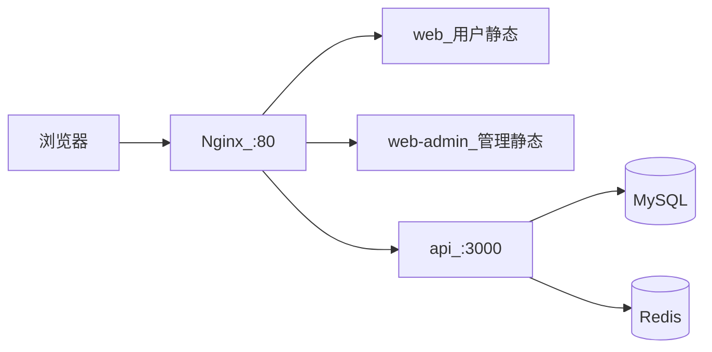

# 公网部署指南

本文说明如何使用 Docker Compose 将**用户端 + 管理端 + API** 部署到云服务器，供评委在线体验。

## 架构（full profile）



- 用户端：`https://你的域名/` → `/m`
- 管理端：`https://你的域名/admin/`
- API：同源反代 `/(auth|lots|auctions|live-rooms|orders|me)` 与 `/socket.io/`

## 前置条件

- 云服务器（建议 2C4G+），已安装 Docker 与 Docker Compose
- 域名解析到服务器公网 IP（可选 HTTPS）
- 安全组放行 **80**、**443**（若用 HTTPS）

## 1. 准备环境变量

```bash
cp .env.example .env
```

编辑 `.env`（生产示例见 `.env.production.example`）：

| 变量 | 说明 |
|------|------|
| `JWT_SECRET` | 长随机字符串，**必改** |
| `CORS_ORIGIN` | `https://你的域名`（若管理端单独子域则逗号分隔） |
| `NODE_ENV` | `production` |

构建时前端使用**同源** API（镜像构建参数已默认 `VITE_API_URL` 为空）。

## 2. 构建并启动

```bash
docker compose up -d mysql redis
# 等待 healthy 后初始化数据库（首次）
docker compose run --rm api npx prisma migrate deploy
docker compose run --rm api npm run db:seed

docker compose --profile full up -d --build
```

服务：

| 容器 | 端口 |
|------|------|
| nginx | 80 |
| api | 3000（内网） |
| web | 5173（内网，用户静态） |
| web-admin | 内网（管理静态） |

访问：`http://服务器IP/` → 用户端；`http://服务器IP/admin/` → 管理端。

## 3. HTTPS（推荐）

在宿主机使用 **Caddy** 或 **certbot + Nginx** 终止 TLS，反代到 `127.0.0.1:80`。

手机体验 WebSocket 时建议使用 HTTPS。

## 4. 演示账号

与本地相同（seed）：

- 主播：`host@example.com` / `password123` → `/admin/`
- 买家：`buyer@example.com` / `password123` → `/m`

## 5. 更新部署

```bash
git pull
docker compose --profile full up -d --build
```

## 6. 常见问题

| 现象 | 处理 |
|------|------|
| 页面能开但接口 404 | 确认走 Nginx 80 入口，而非直接访问 5173 容器 |
| WebSocket 失败 | 检查 Nginx `Upgrade` 头与 `/socket.io/` 反代 |
| 登录后 401 | `JWT_SECRET` 变更后需重新登录；可重新 seed |
| 管理端静态 404 | 确认访问 `/admin/` 且 `web-admin` 容器已启动 |

## 7. 仅用户端 / 分离部署

- 用户静态：`apps/web/dist` → 任意静态托管，构建时设置 `VITE_API_URL`、`VITE_WS_URL` 为 API 公网地址。
- 管理静态：`apps/web/dist-admin`，`VITE_ADMIN_BASE=/admin/`，`basename` 由 Vite `base` 决定。
- API 单独部署时设置 `CORS_ORIGIN` 为前端源列表。

详见 [交付说明.md §6](./交付说明.md#6-在线-demo-链接)。
