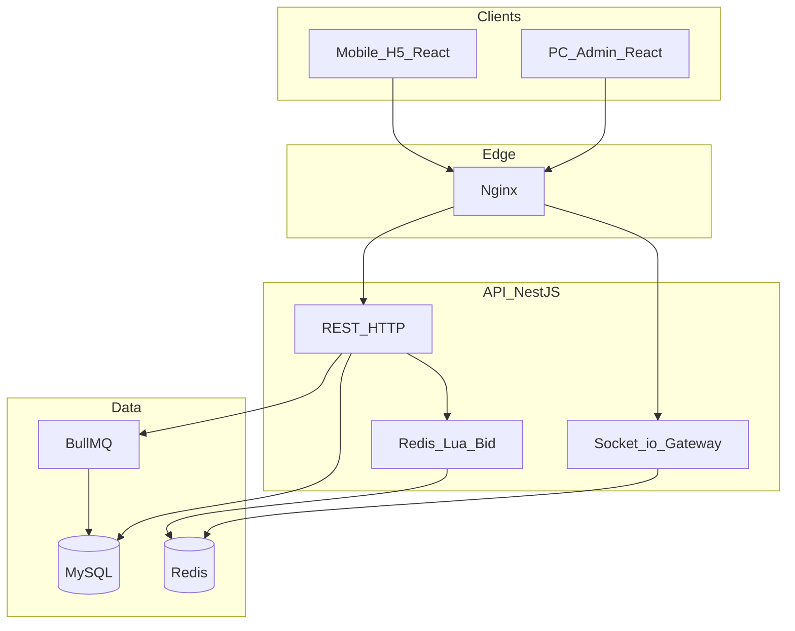
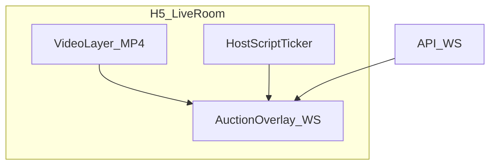

# 直播竞拍系统 — 项目开发方案

> **交付截止**：2026-06-08  
> **用户端形态**：移动端 H5（响应式，不做微信小程序）  
> **文档版本**：v1.0 | 更新日期：2026-05-24

---

## 1. 项目概述

### 1.1 目标

构建面向直播电商场景的实时竞拍平台，覆盖「商品上架 → 规则配置 → 实时出价 → 动态排名 → 成交订单」完整闭环，满足 1000+ 人同场出价、毫秒级倒计时、防狙击延时等核心挑战。

### 1.2 角色

| 角色 | 端 | 说明 |
|------|-----|------|
| 商家/主播 | PC 管理后台 | 发布竞拍、管理商品、查看订单 |
| 买家 | 移动端 H5 | 观看直播、浏览竞拍、出价、支付（模拟）、历史记录 |

### 1.3 与现有实现的关系

当前仓库已完成 **竞拍引擎 MVP**（NestJS + Redis Lua + Socket.io + React 管理台/直播间雏形）。本文档在既有技术方案上补齐产品功能差距，并给出 6.8 前排期。

---

## 2. 技术架构



### 2.1 技术栈

| 层级 | 选型 |
|------|------|
| 前端 | React 18 + TypeScript + Vite + Ant Design |
| 后端 | NestJS + Prisma + MySQL 8 |
| 热路径 | Redis 7 + Lua 原子出价 |
| 实时 | Socket.io + Redis Adapter |
| 队列 | BullMQ（出价落库、订单生成） |
| 部署 | Docker Compose（MySQL、Redis） |

### 2.2 仓库结构

```
live_auction/
├── apps/api/           # NestJS 后端
├── apps/web/           # React（PC 管理 + H5 移动）
├── packages/shared/    # 共享类型与 Zod Schema
├── docs/               # 项目文档（本文档、演示脚本）
├── docker/             # 容器与 Nginx
└── load-tests/         # k6 / Artillery 压测
```

### 2.3 前端信息架构（单应用双布局）

```
apps/web/src/
├── layouts/AdminLayout.tsx      # PC ≥1024px
├── layouts/MobileLayout.tsx     # H5
├── pages/admin/                 # 管理后台
├── pages/mobile/                # 用户 H5
└── pages/                       # 共用（登录等）
```

| 路由前缀 | 用途 |
|----------|------|
| `/admin/*` | 商家/主播 PC 管理 |
| `/m/*` | 买家移动端 H5 |
| `/login` | 登录注册 |

---

## 3. 功能模块对照表

### 3.1 商家/主播端（PC 管理后台）

| 需求 | 优先级 | 现状（实施前） | 计划实现 | 状态 |
|------|--------|----------------|----------|------|
| 竞拍发布：商品名称/图/介绍 | P0 | 已有 Lot CRUD | 保持，表单完善 | ✅ |
| 竞拍规则：起拍价、加价、时长、封顶、延时 | P0 | 固定 0 元起 | 可配置起拍价 + 表单 | ✅ |
| 商品管理：状态/进度/成交 | P0 | 简单列表 | 竞拍看板页 | ✅ |
| 未开始竞拍可改规则 | P0 | 无 | PATCH /auctions/:id（DRAFT） | ✅ |
| 取消异常竞拍 | P0 | API 已有 | 管理台入口 | ✅ |
| 订单管理：成交自动生成、详情 | P0 | 无 | Order 模块 + 列表页 | ✅ |

### 3.2 用户端（移动端 H5）

| 需求 | 优先级 | 现状（实施前） | 计划实现 | 状态 |
|------|--------|----------------|----------|------|
| 直播间：模拟直播画面 | P0 | 无 | 预录视频 + 脚本字幕 | ✅ |
| 竞拍浏览：列表/详情/规则/当前价/人数 | P0 | 简陋列表 | H5 列表+详情+在线人数 | ✅ |
| 出价参与：手动出价、实时排名 | P0 | 核心已有 | H5 直播间大按钮 | ✅ |
| 出价/关键提醒：被超越、延时、结束 | P0 | 无 | WS 事件 + Toast/Notification | ✅ |
| 结果：成交、模拟支付、历史记录 | P0 | 无 | 订单页 + pay-mock API | ✅ |

---

## 4. 数据库与 API 扩展

### 4.1 新增 Order 模型

```prisma
model Order {
  id          String      @id @default(uuid())
  auctionId   String      @unique
  buyerId     String
  amount      Decimal
  status      OrderStatus // PENDING_PAYMENT | PAID | CANCELLED
  paidAt      DateTime?
  createdAt   DateTime
}
```

- 竞拍 `SETTLED` 且存在 `winnerId` 时，BullMQ 自动创建订单。

### 4.2 核心 API 清单

| 方法 | 路径 | 说明 |
|------|------|------|
| PATCH | `/auctions/:id` | 修改 DRAFT 场次规则 |
| GET | `/auctions/dashboard` | 管理台竞拍看板 |
| GET | `/orders` | 订单列表（HOST 看自己场次） |
| GET | `/orders/:id` | 订单详情 |
| POST | `/orders/:id/pay-mock` | 模拟支付 |
| GET | `/me/bids` | 我的出价历史 |
| GET | `/me/orders` | 我的订单 |
| GET | `/auctions/:id` | 增强：含规则、人数、lot 详情 |

### 4.3 WebSocket 事件扩展

| 事件 | 说明 |
|------|------|
| `bid_update` | 已有：出价、排名更新 |
| `timer_sync` | 已有：倒计时同步 |
| `timer_extended` | 新增：软关闭延时触发 |
| `outbid` | 新增：被超越（发给被超越用户） |
| `auction_ended` | 已有：竞拍结束 |
| `auction_cancelled` | 已有：主播取消 |

### 4.4 可配置起拍价

- `ruleSnapshot.startPrice >= 0`
- Redis 初始 `currentPrice = startPrice`
- Lua：无出价记录时首笔 `amount >= startPrice`；有出价后 `amount >= currentPrice + minIncrement`
- 判断「无出价」：`currentPrice == startPrice` 且无 ZSET 成员

---

## 5. 直播间演示方案

### 5.1 方案：预录视频 + 实时竞拍叠加

不依赖真实直播推流，保证演示时竞拍逻辑真实可交互。



| 层级 | 实现 |
|------|------|
| 视频层 | `public/demo/live-room.mp4` 循环静音播放；无文件时显示占位封面 |
| 竞拍层 | 现有 WS：倒计时、出价、排名 |
| 脚本层 | `docs/demo-scripts/` 口播要点；页面底部滚动「主播说」按时间轴展示 |

### 5.2 录屏交付（6/7–6/8）

1. 管理台：创建商品 → 配置规则 → 开播  
2. H5：进入直播间 → 多账号出价 → 触发延时  
3. 成交 → 订单列表 → 模拟支付  
4. OBS 录制双屏，时长约 5 分钟  

详见 [demo-scripts/录屏检查清单.md](./demo-scripts/录屏检查清单.md)。

---

## 6. 开发排期（至 2026-06-08）

| 阶段 | 日期 | 目标 | 产出 |
|------|------|------|------|
| P0-文档 | 5/24 | 方案落盘 | 本文档、demo-scripts |
| P0-底座 | 5/25–5/28 | 订单、起拍价、结算 | Prisma 迁移、Order API |
| P0-管理台 | 5/29–5/31 | 商家闭环 | 看板、订单页、改规则 |
| P0-H5 | 6/1–6/4 | 用户闭环 | 移动布局、直播间、历史 |
| P1-体验 | 6/5–6/6 | 演示打磨 | 通知、人数、种子数据 |
| P1-交付 | 6/7–6/8 | 验收 | 录屏、README 演示路径 |

**P0** = 6.8 必须交付；**P1** = 体验增强。

---

## 7. 环境与部署

```bash
docker compose up -d mysql redis
cp .env.example .env
npm install && npm run build -w @live-auction/shared
cd apps/api && npx prisma migrate deploy && npm run db:seed
npm run dev:api   # :3000
npm run dev:web   # :5173
```

### 演示账号

| 角色 | 邮箱 | 密码 |
|------|------|------|
| 主播 | host@example.com | password123 |
| 买家 | buyer@example.com | password123 |

### H5 访问

- 竞拍大厅：`http://localhost:5173/m`
- 直播间：`http://localhost:5173/m/live/:auctionId`
- 管理台：`http://localhost:5173/admin/auctions`

---

## 8. 风险与待确认

| 风险 | 缓解 |
|------|------|
| Docker 镜像拉取失败 | 本地安装 MySQL/Redis 或离线镜像 |
| 演示视频未生成 | 使用占位图 + 脚本字幕仍可演示 |
| 多人出价测试账号不足 | seed 预置多买家 + 文档说明注册 |
| 浏览器通知需 HTTPS | 开发环境用页内 Toast 为主 |

---

## 9. 相关文档

- [README.md](../README.md) — 快速启动与技术要点  
- [demo-scripts/](./demo-scripts/) — 演示脚本与录屏清单  
- [load-tests/README.md](../load-tests/README.md) — 压测说明  
