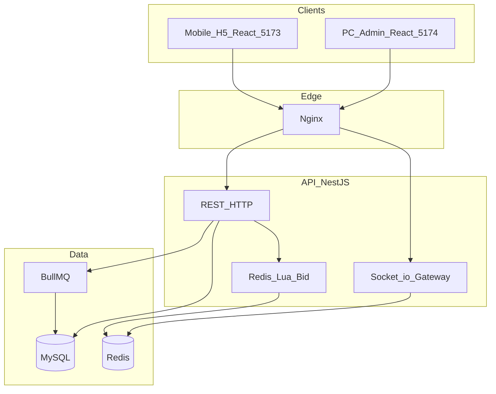
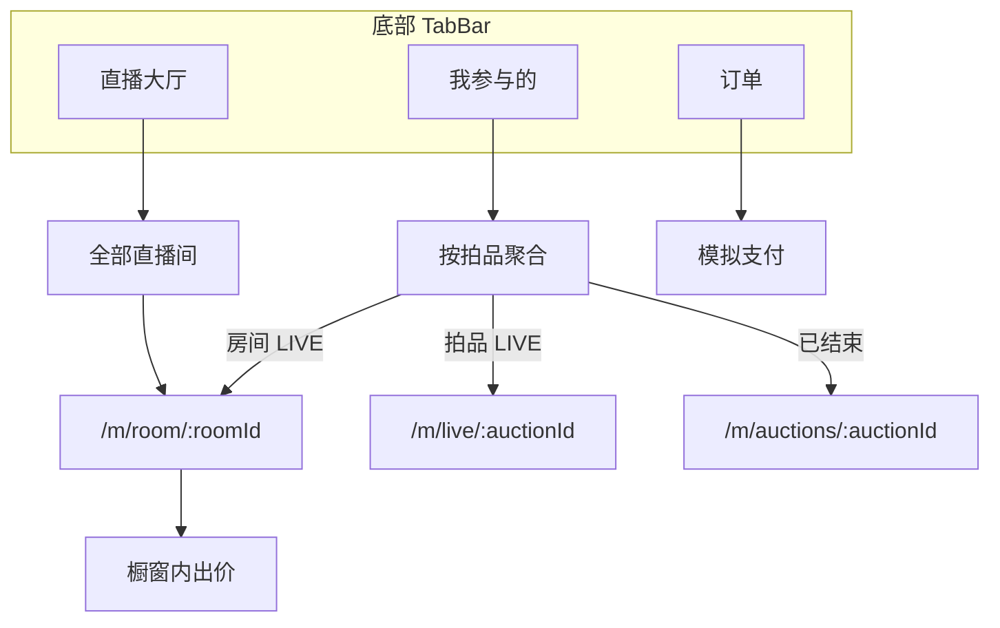

# 直播竞拍系统 — 项目开发方案

> **交付截止**：2026-06-08  
> **用户端形态**：移动端 H5（响应式，不做微信小程序）  
> **文档版本**：v1.1 | 更新日期：2026-05-24

---

## 1. 项目概述

### 1.1 目标

构建面向直播电商场景的实时竞拍平台，覆盖「商品上架 → 规则配置 → 实时出价 → 动态排名 → 成交订单」完整闭环，满足 1000+ 人同场出价、毫秒级倒计时、防狙击延时等核心挑战。

### 1.2 角色

| 角色 | 端 | 说明 |
|------|-----|------|
| 商家/主播 | PC 管理后台（5174） | 直播控制台：上架商品、开播、切品、查看订单 |
| 买家 | 移动端 H5（5173） | 进入直播间出价、「我参与的」跟踪拍品、模拟支付 |

### 1.3 与现有实现的关系

当前仓库已完成 **竞拍引擎 MVP** 及管理端/用户端双应用分离。管理端已收敛为「直播控制台 + 订单管理」；用户端采用「直播大厅 + 我参与的」双入口信息架构。

---

## 2. 技术架构



### 2.1 技术栈

| 层级 | 选型 |
|------|------|
| 前端 | React 18 + TypeScript + Vite + Ant Design / antd-mobile |
| 后端 | NestJS + Prisma + MySQL 8 |
| 热路径 | Redis 7 + Lua 原子出价 |
| 实时 | Socket.io + Redis Adapter |
| 队列 | BullMQ（出价落库、订单生成） |
| 部署 | Docker Compose（MySQL、Redis） |

### 2.2 仓库结构

```
live_auction/
├── apps/api/           # NestJS 后端
├── apps/web/           # React（用户端 + 管理端，两次构建）
├── packages/shared/    # 共享类型与 Zod Schema
├── scripts/            # reset-storage、kill-project-ports 等
├── docs/               # 项目文档、演示脚本
├── docker/             # 容器与 Nginx
└── load-tests/         # k6 / Artillery 压测
```

### 2.3 前端双应用（用户端 / 管理端分离）

同一仓库 `apps/web`，**两次构建、两个 dev 端口**，买家与主播互不混用路由：

| 应用 | 命令 | 默认地址 | 角色 |
|------|------|----------|------|
| 用户端 | `npm run dev:web` | http://localhost:5173 | BUYER |
| 管理端 | `npm run dev:admin` | http://localhost:5174 | HOST / ADMIN |

```
apps/web/src/
├── UserApp.tsx / main.tsx         # 买家 H5：/m/* + 登录
├── AdminApp.tsx / main-admin.tsx  # 管理端：/ + /orders + 登录
├── layouts/MobileLayout.tsx       # H5 底部 Tab
├── pages/admin/AdminLiveConsolePage.tsx  # 直播控制台
└── pages/mobile/                  # H5 各页面
```

#### 用户端路由

| 路由 | 说明 |
|------|------|
| `/login` | 买家登录 / 注册 |
| `/m` | **直播大厅**：全部直播间列表 |
| `/m/room/:roomId` | 多品橱窗（推荐主路径） |
| `/m/live/:auctionId` | 单场出价页（深链，从橱窗或「我参与的」进入） |
| `/m/auctions/:auctionId` | 拍品只读详情 |
| `/m/participations` | **我参与的**：按拍品聚合 |
| `/m/orders` | 我的订单 |
| `/m/history` | 重定向 → `/m/participations` |

底部 Tab：**大厅** · **我参与的** · **订单**（后两项需买家登录）。

#### 管理端路由

| 路由 | 说明 |
|------|------|
| `/login` | 主播 / 管理员登录 |
| `/` | **直播控制台**：房间、待上架/直播中、添加商品、切品 |
| `/orders` | 订单管理 |
| `/dashboard`、`/auctions`、`/live-rooms`、`/lots` 等 | 重定向 → `/` |

登录态分存：`accessTokenUser` / `accessTokenAdmin`（localStorage + zustand persist）。生产建议用户域与运营域分域名部署（`dist` / `dist-admin`）。

---

## 3. 功能模块对照表

### 3.1 商家/主播端（管理后台）

| 需求 | 优先级 | 实现 | 状态 |
|------|--------|------|------|
| 直播控制台：选房间、待上架/直播中双 Tab | P0 | `AdminLiveConsolePage` | ✅ |
| 一体化添加商品（Lot + Auction + 入队） | P0 | `AddLiveProductModal` | ✅ |
| 切品讲解、下架、房间开播 | P0 | switch / go-live / detach API | ✅ |
| 竞拍规则：起拍价、加价、时长、封顶、延时 | P0 | 添加商品表单 + ruleSnapshot | ✅ |
| 订单管理：成交列表 | P0 | `/orders` 页 | ✅ |
| 取消异常竞拍 | P0 | 控制台内操作 | ✅ |

### 3.2 用户端（移动端 H5）

| 需求 | 优先级 | 实现 | 状态 |
|------|--------|------|------|
| 直播大厅：全部直播间入口 | P0 | `GET /live-rooms` + `MobileHomePage` | ✅ |
| 进直播间橱窗：多品状态、出价 | P0 | `/m/room/:id` + WS 同步 | ✅ |
| 我参与的：按拍品聚合、领先/被超越 | P0 | `GET /me/participations` | ✅ |
| 出价/提醒：被超越、延时、结束 | P0 | WS + Toast | ✅ |
| 订单与模拟支付 | P0 | `/m/orders` + pay-mock | ✅ |
| 预录视频 + 脚本字幕 | P0 | `LiveVideoLayer` + ticker | ✅ |

#### 用户端信息架构（双入口）



首页**不再**单独展示「单场竞拍」列表；单场路由仅作深链保留。

---

## 4. 数据库与 API 扩展

### 4.1 Order 模型

```prisma
model Order {
  id          String      @id @default(uuid())
  auctionId   String      @unique
  buyerId     String
  amount      Decimal
  status      OrderStatus // PENDING_PAYMENT | PAID | CANCELLED
  paidAt      DateTime?
  createdAt   DateTime
}
```

竞拍 `SETTLED` 且存在 `winnerId` 时，由结算流程创建订单。

### 4.2 核心 API 清单

| 方法 | 路径 | 说明 |
|------|------|------|
| GET | `/live-rooms` | 全部直播场次（H5 大厅） |
| GET | `/live-rooms/mine` | 主播自己的房间（HOST） |
| GET | `/live-rooms/:id/showcase` | 橱窗列表 |
| POST | `/live-rooms/:id/go-live` | 房间开播 |
| POST | `/live-rooms/:id/switch/:auctionId` | 切品讲解 |
| DELETE | `/live-rooms/:id/auctions/:auctionId` | 从房间下架拍品 |
| PATCH | `/auctions/:id` | 修改 DRAFT 场次规则 |
| POST | `/auctions/:id/bids` | 出价 |
| GET | `/me/participations` | 我参与的拍品（按 auction 聚合） |
| GET | `/me/bids` | 出价流水（调试/Swagger） |
| GET | `/me/orders` | 我的订单 |
| GET | `/orders` | 订单列表（HOST） |
| POST | `/orders/:id/pay-mock` | 模拟支付 |

#### `GET /me/participations` 响应字段

| 字段 | 说明 |
|------|------|
| `auctionId`, `title`, `status` | 拍品标识与状态 |
| `myMaxBid`, `currentPrice`, `isLeading` | 我的最高价、当前价、是否领先 |
| `roomId`, `roomTitle`, `roomStatus` | 所属直播间 |
| `imageUrl` | 商品图 |
| `orderStatus` | 若已落槌且有订单 |

### 4.3 WebSocket 事件

| 事件 | 说明 |
|------|------|
| `bid_update` | 出价、排名更新 |
| `timer_sync` | 倒计时同步 |
| `timer_extended` | 软关闭延时 |
| `outbid` | 被超越（定向推送） |
| `auction_ended` | 竞拍结束 |
| `showcase_updated` | 橱窗整表更新 |

### 4.4 可配置起拍价

- `ruleSnapshot.startPrice >= 0`
- Redis 初始 `currentPrice = startPrice`
- Lua：无出价时首笔 `amount >= startPrice`；有出价后 `amount >= currentPrice + minIncrement`

### 4.5 直播场次（LiveRoom）与橱窗

一场直播对应一个 `LiveRoom`，内含多件 `Auction`（`roomId` + `sortOrder`）。同一时刻仅一件为「讲解中」（`activeAuctionId`）。

| 展示状态 | DB 状态 | UI 文案 |
|----------|---------|---------|
| BIDDING | LIVE | 竞拍中 + 倒计时 |
| UPCOMING | SCHEDULED / DRAFT | 即将开拍 |
| FAILED | SETTLED 无 winner | 竞拍未成交 |
| SOLD | SETTLED 有 winner | 竞拍结束 / 落槌价 |

演示种子：`npm run storage:reset` 或 `cd apps/api && npm run db:seed` 后访问  
http://localhost:5173/m/room/00000000-0000-4000-8000-00000000ROOM

---

## 5. 直播间演示方案

### 5.1 预录视频 + 实时竞拍叠加

| 层级 | 实现 |
|------|------|
| 视频层 | `public/demo/live-room.mp4` 循环静音；无文件时占位封面 |
| 竞拍层 | WS：倒计时、出价、排名 |
| 脚本层 | `docs/demo-scripts/` 口播要点 |

### 5.2 录屏交付建议

1. **管理端**：登录 → 直播控制台 → 待上架添加商品 → 开播 / 切品  
2. **H5**：大厅进直播间 → 橱窗出价 →「我参与的」查看领先状态  
3. 成交 → 管理端订单 + H5 模拟支付  

详见 [demo-scripts/录屏检查清单.md](./demo-scripts/录屏检查清单.md)。

---

## 6. 开发排期（至 2026-06-08）

| 阶段 | 日期 | 目标 | 产出 |
|------|------|------|------|
| P0-文档 | 5/24 | 方案落盘 | 本文档、demo-scripts |
| P0-底座 | 5/25–5/28 | 订单、起拍价、结算 | Prisma 迁移、Order API |
| P0-管理台 | 5/29–5/31 | 商家闭环 | 直播控制台、订单页 |
| P0-H5 | 6/1–6/4 | 用户闭环 | 双入口 IA、我参与的、订单 |
| P1-体验 | 6/5–6/6 | 演示打磨 | 通知、种子、401 重登提示 |
| P1-交付 | 6/7–6/8 | 验收 | 录屏、README |

---

## 7. 环境与部署

```bash
docker compose up -d mysql redis
cp .env.example .env
npm install && npm run build -w @live-auction/shared
cd apps/api && npx prisma migrate deploy && npm run db:seed

# 三终端开发
npm run dev:api    # :3000
npm run dev:web    # :5173 用户端
npm run dev:admin  # :5174 管理端
```

### 工具脚本

| 命令 | 说明 |
|------|------|
| `npm run storage:reset` | 重置 MySQL + Redis 并 seed |
| `npm run ports:check` | 检查项目端口占用 |
| `npm run ports:kill` | 释放 3000 / 5173 / 5174 |

### 演示账号

| 角色 | 邮箱 | 密码 | 入口 |
|------|------|------|------|
| 主播 | host@example.com | password123 | http://localhost:5174 |
| 买家 | buyer@example.com | password123 | http://localhost:5173 |

### 访问地址

| 页面 | URL |
|------|-----|
| 用户端大厅 | http://localhost:5173/m |
| 演示橱窗 | http://localhost:5173/m/room/00000000-0000-4000-8000-00000000ROOM |
| 我参与的 | http://localhost:5173/m/participations |
| 管理端控制台 | http://localhost:5174/ |
| API Swagger | http://localhost:3000/docs |

### 常见问题

| 现象 | 处理 |
|------|------|
| 「订单 / 我参与的」无法加载 | 多因 JWT 过期或与 `.env` 中 `JWT_SECRET` 不一致；重新登录买家账号 |
| 执行 `storage:reset` 后数据为空 | 预期行为；重新 seed 后刷新页面 |
| 5174 打不开 | 须单独运行 `npm run dev:admin`，非 `dev:web` |

---

## 8. 风险与待确认

| 风险 | 缓解 |
|------|------|
| Docker 镜像拉取失败 | 本地安装 MySQL/Redis 或离线镜像 |
| 演示视频未生成 | 占位图 + 脚本字幕仍可演示 |
| 多人出价测试账号不足 | seed 预置 buyer / buyer2 |
| 浏览器通知需 HTTPS | 开发环境以页内 Toast 为主 |
| JWT 密钥变更导致 401 | 前端自动登出并提示重新登录 |

---

## 9. 相关文档

- [交付说明.md](./交付说明.md) — 赛方 14 项提交对照（课题、流程、亮点、仓库与 Demo）  
- [部署指南.md](./部署指南.md) — 公网 Docker 部署  
- [压测报告.md](./压测报告.md) — k6 / Artillery 压测记录模板  
- [README.md](../README.md) — 快速启动与技术要点  
- [新人开发指南.md](./新人开发指南.md) — 模块与函数详解  
- [Redis开发指南.md](./Redis开发指南.md) — Redis 数据结构与出价热路径  
- [demo-scripts/](./demo-scripts/) — 演示脚本与录屏清单  
- [demo-scripts/彩排验收表.md](./demo-scripts/彩排验收表.md) — 彩排功能量化验收（DRS）  
- [load-tests/README.md](../load-tests/README.md) — 压测说明  
